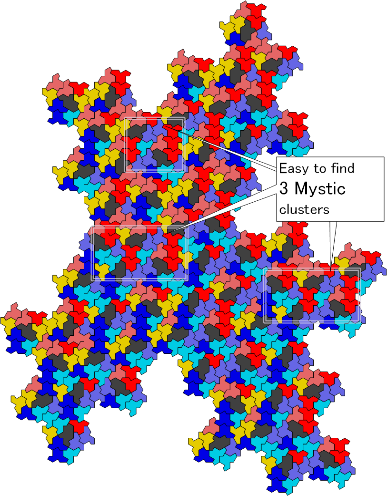

# symbolic-spectre-tiles
Ruby script for genrates  spectre tiles by symbolic coordinates like the expression.
This Ruby script not only generates SVG files for Tile(a,b) coefficients but also produces a CSV file containing symbolic coordinates like the expression:
```
((16.5)*A + (-2.5)*B*√3) - ((19.5)*B + (11.5)*A*√3)*i
```

# Usage
## Edit Configurations
You can update the following parameters at the beginning of the Ruby script:


```Ruby
## Configuration
#* Increase this number for larger tilings.
N_ITERATIONS = 4
#* Shape Edge_ratio tile(Edge_a, Edge_b)
Edge_a = 10.0 # 20.0 / (Math.sqrt(3) + 1.0)
Edge_b = 10.0 # 20.0 - Edge_a
## End of Configuration.
```

## Generating SVG Files Quickly
If you want to generate only SVG files promptly, spectre-tiles_float.rb is the tool for you.
Simply run the following command:
```
> ruby spectre-tiles_float.rb
```

## Generating SVG Files with CSV File Containing Symbolic Coordinates.
If you want to create both SVG files with floating-point transfer coordinates and a CSV file containing symbolic coordinates, you can use the spectre-tiles_Symbolic.rb script. 
Simply run the following command:
   ```
   ruby spectre-tiles_Symbolic.rb
   ```

* console outputs

  it provides useful information for verifying the drawn Spectre tiles 
  and for convenient clipping.
  The output includes the following details:
  * Spectre Shape Coordinates by symbolic and floating-point for given ration of Edge_a Edge_b.
  * Spectre tiling Quad points Coordinates.
  * total number of Spectre tile's.
  * Spectre tile's Count by rotated angles. 

```
coef A = 7.320508075688773		Ratio(0.366)
coef B = 12.679491924311227		Ratio(0.634)
SPECTRE_POINTS = [
	0+0i, 		(0.0 + 0.0*i),
	((1.0)*A)+0i, 		(7.3205 + 0.0*i),
	((1.5)*A)-((0.5)*A*√3)*i, 		(10.9808 + -6.3397*i),
	((1.5)*A + (0.5)*B*√3)+((0.5)*B + (-0.5)*A*√3)*i, 		(21.9615 + 0.0*i),
	((1.5)*A + (0.5)*B*√3)+((1.5)*B + (-0.5)*A*√3)*i, 		(21.9615 + 12.6795*i),
	((2.5)*A + (0.5)*B*√3)+((1.5)*B + (-0.5)*A*√3)*i, 		(29.282 + 12.6795*i),
	((3.0)*A + (0.5)*B*√3)+((1.5)*B)*i, 		(32.9423 + 19.0192*i),
	((3.0)*A)+((2.0)*B)*i, 		(21.9615 + 25.359*i),
	((3.0)*A + (-0.5)*B*√3)+((1.5)*B)*i, 		(10.9808 + 19.0192*i),
	((2.5)*A + (-0.5)*B*√3)+((1.5)*B + (0.5)*A*√3)*i, 		(7.3205 + 25.359*i),
	((1.5)*A + (-0.5)*B*√3)+((1.5)*B + (0.5)*A*√3)*i, 		(**0.0** + 25.359*i),
	((0.5)*A + (-0.5)*B*√3)+((1.5)*B + (0.5)*A*√3)*i, 		(-7.3205 + 25.359*i),
	((-0.5)*B*√3)+((1.5)*B)*i, 		(-10.9808 + 19.0192*i),
	0+((1.0)*B)*i, 		(0.0 + 12.6795*i),
]
Mystic_SPECTRE_POINTS = [
	0+0i, 		(0.0 + 0.0*i),
	((1.0)*B)+0i, 		(12.6795 + 0.0*i),
	((1.5)*B)-((0.5)*B*√3)*i, 		(19.0192 + -10.9808*i),
	((1.5)*B + (0.5)*A*√3)-((-0.5)*A + (0.5)*B*√3)*i, 		(25.359 + -7.3205*i),
	((1.5)*B + (0.5)*A*√3)+((1.5)*A + (-0.5)*B*√3)*i, 		(25.359 +  **0.0*i**),
	((2.5)*B + (0.5)*A*√3)+((1.5)*A + (-0.5)*B*√3)*i, 		(38.0385 + **0.0*i**),
	((3.0)*B + (0.5)*A*√3)+((1.5)*A)*i, 		(44.3782 + 10.9808*i),
	((3.0)*B)+((2.0)*A)*i, 		(38.0385 + 14.641*i),
	((3.0)*B + (-0.5)*A*√3)+((1.5)*A)*i, 		(31.6987 + 10.9808*i),
	((2.5)*B + (-0.5)*A*√3)+((1.5)*A + (0.5)*B*√3)*i, 		(25.359 + 21.9615*i),
	((1.5)*B + (-0.5)*A*√3)+((1.5)*A + (0.5)*B*√3)*i, 		(12.6795 + 21.9615*i),
	((0.5)*B + (-0.5)*A*√3)+((1.5)*A + (0.5)*B*√3)*i, 		(0.0 + 21.9615*i),
	((-0.5)*A*√3)+((1.5)*A)*i, 		(-6.3397 + 10.9808*i),
	0+((1.0)*A)*i, 		(0.0 + 7.3205*i),
]
* 3 Iterations, generated 559 tiles
 quad[0] = ((21.0)*A + (-8.0)*B*√3)-((31.0)*B + (23.0)*A*√3)*i	(-21.961524227066292)+(-684.6925639128062)*i
 quad[1] = ((41.5)*A + (4.5)*B*√3)-((34.5)*B + (11.5)*A*√3)*i	(402.6279441628825)+(-583.2566285183163)*i
 quad[2] = ((34.5)*A + (12.5)*B*√3)-((17.5)*B + (-4.5)*A*√3)*i	(527.0765814495917)+(-164.83339501604596)*i
 quad[3] = ((-10.0)*A + (-7.0)*B*√3)-((8.0)*A*√3)*i	(-226.93575034635197)+(-101.4359353944898)*i
buildSpectreTiles process 0.0109042sec.
 each angle's tile count =	{-150=>8, -120=>74, -90=>9, -60=>79, -30=>11, 0=>87, 30=>14, 60=>90, 90=>12, 120=>87, 150=>9, 180=>79, 360=>63}
"svg file write process 0.0243781sec"
"csv file write process 0.0173199sec"
"total process time 0.0526719sec"
"save filename="
"spectre-tile7.3-12.6-3-559tiles.svg"
```

* Contents of the SVG File

  * shape's coordinates

    The original JavaScript code used 28 floating-point numbers to draw a single Spectre shape, resulting in a file size of approximately 500 characters. Additionally, the Python code it was based on utilized 6 floating-point numbers, including affine transformation coefficients, and resulted in a file size of around 200 characters. Notably, the Python code often expressed values like sin(60 deg) = 0.5 as lengthy strings such as 0.499999999999.

    In contrast, this program generates a more compact SVG file for a single Spectre shape using only 2 floating-point numbers to represent translation (movement) and 1 integer to denote rotation angle.

    Focusing on the quad coordinates of the Spectre shape rather than examining all 14 vertex coordinates can provide more concise insights.

  * Spectre Shapes and Their Colors

    In the original JavaScript code, colors were assigned based on the label type for the Spectre shapes.
    The arrangement of labels in a fractal pattern is crucial evidence for generating tilings of the weakly chiral aperiodic monotile Tile(1,1) known as “Spectre”.

    In this code, except for the label=“Gamma2” colors are determined by the rotation angles of the shapes.
    This approach facilitates the discovery of locally similar clusters within the generated shapes.
    Additionally, the labels are displayed using &lt;text&gt; tags that specify the same rotation angle as the shape.
    If you find the label text distracting, you can simply comment out the code that outputs the &lt;text&gt; tags.

    Take a look at the image below:
      
      
      Mystec Spectre Shapes Clusters　   
      

    
     Feel free to explore the fascinating patterns and colors!
  

* Contents of the CSV File

    This compact CSV file provides essential information for working with Spectre shapes. The quad coordinates of the Spectre shape can be easily extracted from this data.

    - **label**: The label associated with original Papers.
    - **transform**: The transformation expressed as a complex number (e.g., "0+0i").
    - **angle**: The rotation angle in degrees(0,30,60,90,120,180,240).
    - **transform[0]** and **transform[1]**: Affine transformation coef of rotation. it not Includes SVG-file.
    - **transform[2].X** and **transform[2].Y: The coordinate of transformation. same as SVG-file.

| label | transform {A:7.320508075688773, B:12.679491924311227} | angle | transform[0].x | transform[0].y | transform[1].x | transform[1].y | transform[2].x | transform[2].y |
|-------|-----------------------------------------------------|-------|-----------------|-----------------|-----------------|-----------------|-----------------|-----------------|
| "Psi" | "0+0i"                                              | 0     | 1.0             | 0.0             | 0.0             | 1.0             | 0.0             | 0.0             |
| "Delta" | "((-1.5)*A)-((0.5)*A*√3)*i"                        | 60    | 0.5             | 0.8660254037844386 | -0.8660254037844386 | 0.5 | -10.98076211353316 | -6.339745962155613 |
|  | ... (omitted for brevity) ...
| "Gamma1" | "((-12.0)*A + (18.0)*B*√3)-((36.0)*B + (36.0)*A*√3)*i" |  0 | 1.0 | 0.0 | 0.0 | 1.0 | 307.4613391789284 | -912.9234185504083 |
| "Gamma2" | "((-9.0)*A + (17.5)*B*√3)-((34.5)*B + (36.0)*A*√3)*i"  | 30 | 0.8660254037844386| 0.5 | -0.5 |0.8660254037844386 | 318.4421012924616 | -893.9041806639415 |

## clipping SVG Files
  To crop a rectangular region from the SVG files generated by the previous command, you can use **svg-cutter2.rb**. 
  When specifying the minimum X and Y coordinates as well as the maximum X and Y coordinates for cropping a rectangular region, you can refer to the quad vertex coordinates output by the previous command.

  * The general format is: 
  ```
  ruby input_svg_filename min_x min_y max_x max_y
  ```

       * Explanation

          - **Input SVG File**: The original SVG file you want to crop.
          - **min_x**, **min_y**: The minimum X and Y coordinates of the rectangular clipping area.
          - **max_x**, **max_y**: The maximum X and Y coordinates of the rectangular clipping area.
          - **Output File**: The resulting SVG file containing the cropped region.

  * exsample output
    
      ```
      > ruby svg-cutter2.rb spectre-tile7.3-12.6-4-4401tiles.svg  300 -1000 1400 -700
      ```
      ```
      ["rect point X,Y", 856.4994448555865, -1775.1288694035716]
      ["rect point X,Y", 1786.2039704680606, -976.3208781719644]
      ["rect point X,Y", 1559.2682201217085, 228.2308546376022]
      ["rect point X,Y", -402.6279441628825, -583.2566285183163]
      input range=(-538.0573435631248,-1889.2442967223728)-(1921.633369868303,1065.077321642143)
       output file = "spectre-tile7.3-12.6-4-4401tiles_(300,-1000)-(1400,-700).svg" 
      ```

  * Clipped SVG File
      -(1400,-700).svg)


# Message to Contributors
## Adding Self-Verification and Debugging Information
    
   In the source code of this program, we’ve included code for self-verification and debugging purposes.
   We encourage adding information for analyzing the features of Spectre tileings and retaining the self-verification code as comments without removing it.

   Providing such detailed information in the README file for MPL-licensed source code helps other developers understand the codebase more effectively.
   The self-verification and debugging comments contribute to improving the overall quality of the project. 

 

# Acknowledgments
This project provides a Ruby script that can generate the weakly chiral aperiodic monotile called Tile(a,b) “Spectre”. 
This Ruby script is a port of the original Python script available here. 
Additionally, the Python script[4] [5] itself was inspired by the research paper authored by the creators.
ported from JavaScript from the web app [1] provided [2] by the authors of the original research paper [3].

[1]: https://cs.uwaterloo.ca/~csk/spectre/app.html

[2]: https://cs.uwaterloo.ca/~csk/spectre/

[3]: https://arxiv.org/abs/2305.17743

[4]: https://github.com/shrx/spectre/issues/1

[5]: https://github.com/reversi-fun/spectre
    